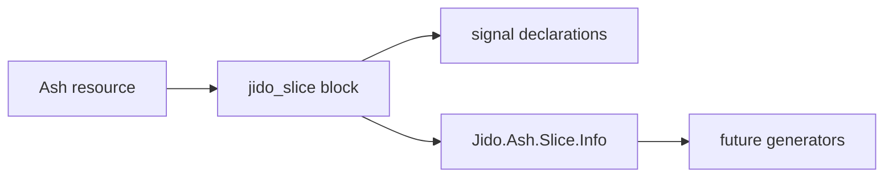

# Ash-backed slice DSL — developer documentation

Developers can declare the Jido slice authoring surface on an Ash resource. The
resource records slice metadata and signal-to-action bindings through a
`jido_slice` block; later implementation tasks derive schemas, generated actions,
and mountable runtime slices from the same declarations.

## Stories

| ID | Story | File |
| --- | --- | --- |
| US-AJSL-01 | Declare an Ash-backed slice resource | [US-AJSL-01](./US-AJSL-01-declare-ash-backed-slice-resource.md) |
| US-AJSL-05 | Inspect Ash-backed slice declarations | [US-AJSL-05](./US-AJSL-05-inspect-ash-backed-slice-declarations.md) |
| US-AJSL-07 | Derive slice state from Ash attributes | [US-AJSL-07](./US-AJSL-07-derive-slice-state-from-ash-attributes.md) |
| US-AJSL-08 | Reject unsupported slice state attributes | [US-AJSL-08](./US-AJSL-08-reject-unsupported-slice-state-attributes.md) |
| US-AJSL-09 | Derive signal payload schemas from Ash actions | [US-AJSL-09](./US-AJSL-09-derive-signal-payload-schemas-from-ash-actions.md) |
| US-AJSL-10 | Reject signals bound to missing actions | [US-AJSL-10](./US-AJSL-10-reject-signals-bound-to-missing-actions.md) |
| US-AJSL-11 | Generate stable reducer action modules | [US-AJSL-11](./US-AJSL-11-generate-stable-reducer-action-modules.md) |
| US-AJSL-12 | Adapt Ash reducer success results | [US-AJSL-12](./US-AJSL-12-adapt-ash-reducer-success-results.md) |
| US-AJSL-13 | Preserve Ash reducer error results | [US-AJSL-13](./US-AJSL-13-preserve-ash-reducer-error-results.md) |

## See also

- [Ash-native Jido slices RFC](../../../../../../documentation/rfc/ash-native-jido-slices.md)
- [Ash-native Jido slices plan](../../../../../../documentation/plans/ash-native-jido-slices.md)
