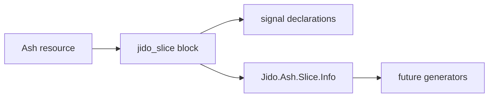

# Ash-backed slice DSL — developer documentation

Developers can declare the Jido slice authoring surface on an Ash resource. The
resource records slice metadata and signal-to-action bindings through a
`jido_slice` block; later implementation tasks derive schemas, generated actions,
and mountable runtime slices from the same declarations.

## Stories

| ID | Story | File |
| --- | --- | --- |
| US-AJSL-01 | Declare an Ash-backed slice resource | [US-AJSL-01](./US-AJSL-01-declare-ash-backed-slice-resource.md) |
| US-AJSL-05 | Inspect Ash-backed slice declarations | [US-AJSL-05](./US-AJSL-05-inspect-ash-backed-slice-declarations.md) |

## See also

- [Ash-native Jido slices RFC](../../../../../../documentation/rfc/ash-native-jido-slices.md)
- [Ash-native Jido slices plan](../../../../../../documentation/plans/ash-native-jido-slices.md)
